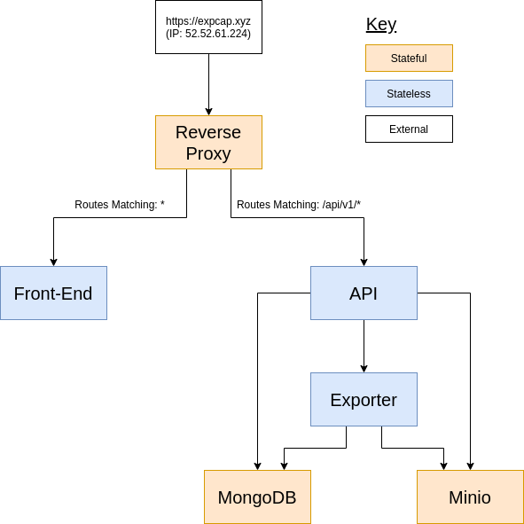
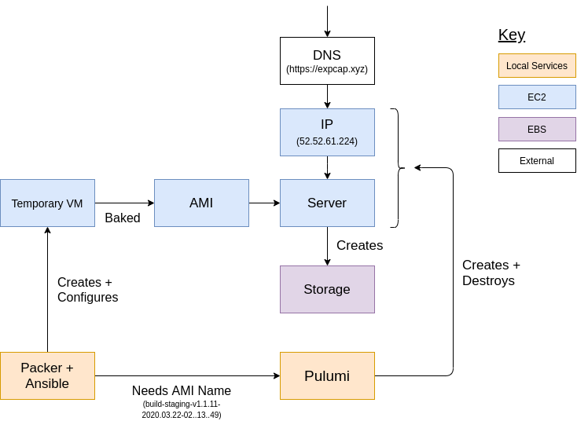
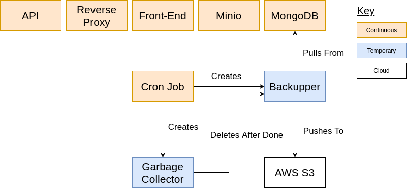

# Architecture Overview

Experience Capture uses a [client-server model](https://en.wikipedia.org/wiki/Client%E2%80%93server_model) and is a little special because there is both a client for in-game and the web. The main goals of this architecture are to make the service as simple as possible, reduce costs, and allow it to be maintainable and extensible in the future.

## Dataflow

Outline of how data flows through the server, some notes:

- Stateful/Stateless is referring to whether the service stores data.
- The reverse proxy (Caddy) uses longest prefix match for routing, meaning a route of `/api/v1/*` will always be preferred to a route of `*`.

## Deploying

Outline of the deployment process, some notes:

- EC2 and EBS refer to [AWS Services.](https://aws.amazon.com/)
- Storage is only ever created, never destroyed, which allows it to persist between deploys.

## Infrastructure

Outline of what happens inside of the server, besides dataflow, some notes:

- The garbage collector's main duty is to cleanup the Backupper, but it deletes everything including itself that is stopped.
- Continuous means a server shouldn't stop under normal circumstances, not that it never will.
- AWS S3 refers to [this service](https://aws.amazon.com/s3/).