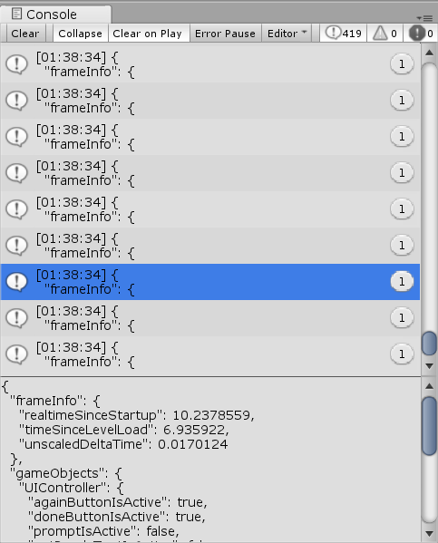

# Coding

This section will cover how to add data capture logic to c# scripts in your scenes.

## Setup Script

1. Add the following namespace:

```csharp
using Capture;
```

1. Have the class extend the `ICapturable` interface in addition to MonoBehavior.

```csharp
using Capture;

public class Example : MonoBehaviour, ICapturable
{
	// Class stuff
}
```

2. Add the GetCapture() function to satisfy the ICapturable [interface](https://docs.microsoft.com/en-us/dotnet/csharp/language-reference/keywords/interface).

```csharp
using Capture;

public class Example : MonoBehaviour, ICapturable
{

    // Class stuff
	
    public object GetCapture() 
    {
        return new 
        {
            
        };
    }

}
```

**Check:** There shouldn't be any compile or runtime errors.

## Add properties 

With everything setup, data to be captured can now be added. The basic format is:

```csharp
    public object GetCapture()
    {
        return new
        {
            positionX = transform.position.x, // separate properties with a comma 
            propertyName = gameObject.value, // trailing comma recommend
        };
    }
```
This is using an [Anonymous type](https://docs.microsoft.com/en-us/dotnet/csharp/programming-guide/classes-and-structs/anonymous-types).
It lets you define implicitly (meaning without having to declare `int`, `string`, etc) typed objects simply.

Now run the Setup scene, and you should see a [JSON](https://www.newtonsoft.com/json) object
being printed to console. It should have an info key, and a key called the same name as the
object this script is attached too.



##### Example of console output, although with different names and values. 

## How Does It Capture Data?

Experience Capture works by running the 'GetCapture()' function on each `ICapturable`
game object over specific intervals. The capture rate can be set as often or little 
as wanted through the prefab, and is based on frame-rate. Additional information 
about the frame is also included automatically, like timestamps. This can be called 
an 'eventless' data capture system, which is designed to be easier to use than
an event based one like Unity Analytics. For more information see [here](About-Capture.md).

## Valid Data Types 

Data is serialized to [JSON]((https://developer.mozilla.org/en-US/docs/Web/JavaScript/Data_structures) which has a limited number of data types, mainly:
- Boolean (`bool`)
- Number (`int`, `float`, etc.)
- String (`string`)
- Objects (like `new { ... }`)

It is not recommend to use strings when exporting numbers. Nested objects are fine. This is what can NOT be exported directly:
- Vector3 (See next section for how to capture)
- MonoBehavior (Get specific values from each game object)

#### Vector3

[Vector3s](https://docs.unity3d.com/ScriptReference/Vector3.html), like position in this example can't be directly serialized to JSON.
Instead, you can use the [extension method](https://docs.microsoft.com/en-us/dotnet/csharp/programming-guide/classes-and-structs/extension-methods) `.ToAnonymousType()` like so.

```csharp
    public object GetCapture()
    {
        return new
        {
            position = this.transform.position.ToAnonymousType(),
        };
    }
```

Which is the same as the following code.


```csharp
    public object GetCapture()
    {
        return new
        {
            position = new
            {
                this.transform.position.x,
                this.transform.position.y,
                this.transform.position.z,
            }
        };
    }
```

### Vector2

[Vector2s](https://docs.unity3d.com/ScriptReference/Vector2.html) work the same way as Vector3s, with `ToAnonymousType()`.


## Helpers

### Calulate the angle between two game objects.

```csharp
firstObject.AngleWith(secondObject);
```
Also draw lines for debugging:
```charp
firstObject.AngleWith(secondObject, true);
``

## Next Part

If all the checks are fine, everything should be setup. Next Section: [How Your Data is Captured (optional).](About-Capture.md).

Additionally, there is [extra documentation on configuration (optional).](Configure.md)