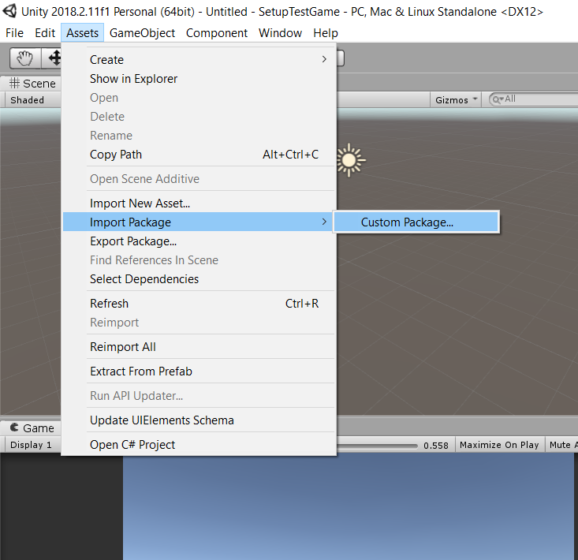
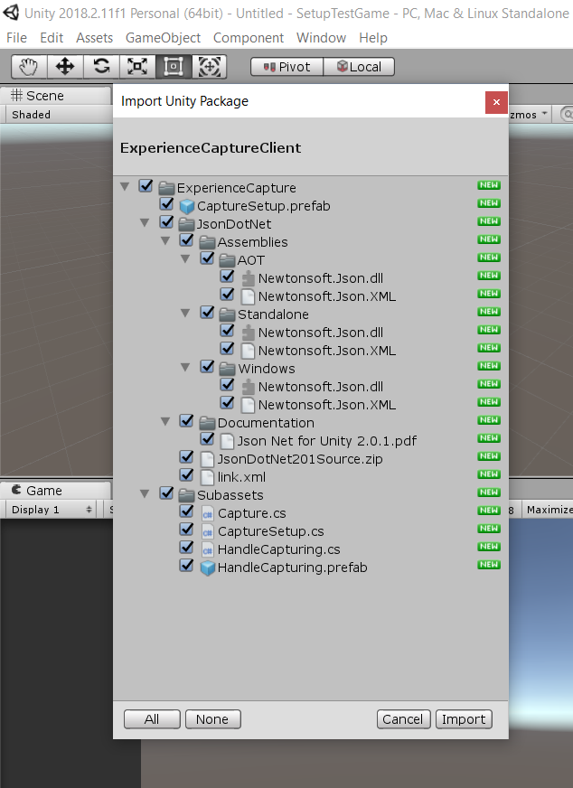
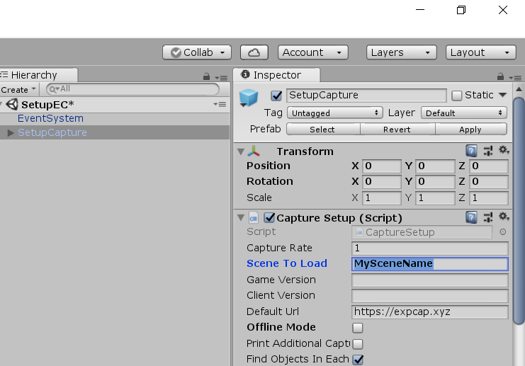

# Installation

## Download Asset Package

Get the latest client [here](https://github.com/jhburns/ExperienceCapture/releases/tag/client.1.2.0).

Click on the first link 'ExperienceCaptureClient.unitypackage' to download it, no extraction needed.

## Import Into Unity Game

In the Unity Editor, go to Assets -> Import Package -> Custom Package... and select it.

That will open a file-browser so you can navigate to where 'ExperienceCaptureClient.unitypackage'
is downloaded and open it. 

You should now have a pop-up with all of the assets selected by default. Install **everything** by clicking on
'Import' to add the package.

**Check:** If everything worked, there should be a new folder called `ExperienceCapture/` inside your assets folder.

## Configure Setup Scene

- Go into the `ExperienceCapture/` folder.
- Select the scene called 'SetupEC'.
- Click on the `SetupCapture` object in the Unity Hierarchy.
- Change the `Scene To Load` value to whatever scene you want loaded first.

**Check:** Pressing the Start Session button in the 'SetupEC' scene should load the scene you provided.
There should also be a game object with the name `HandleCapturing` under the 'DontDestroyOnLoad' portion of the Unity Hierarchy.

### Close Game

Close the game by pressing `Q` on your keyboard. Please do not normally close the game, and instead use
this shortcut, or load the 'CleanupEC' scene instead.

## Add Scenes To Build

Open the two scenes in `ExperienceCapture/`, 'SetupEC' and 'CleanupEC'. Then click on File > Build Settings > Add Open Scenes for each.

## Next Part

If all the checks are fine, everything should be setup. Next Section: [Coding the data capture.](Coding.md)