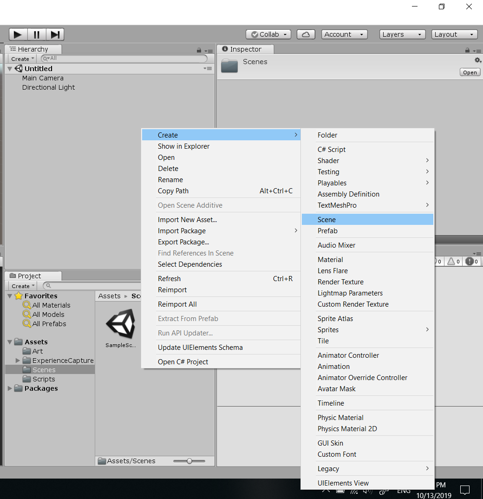
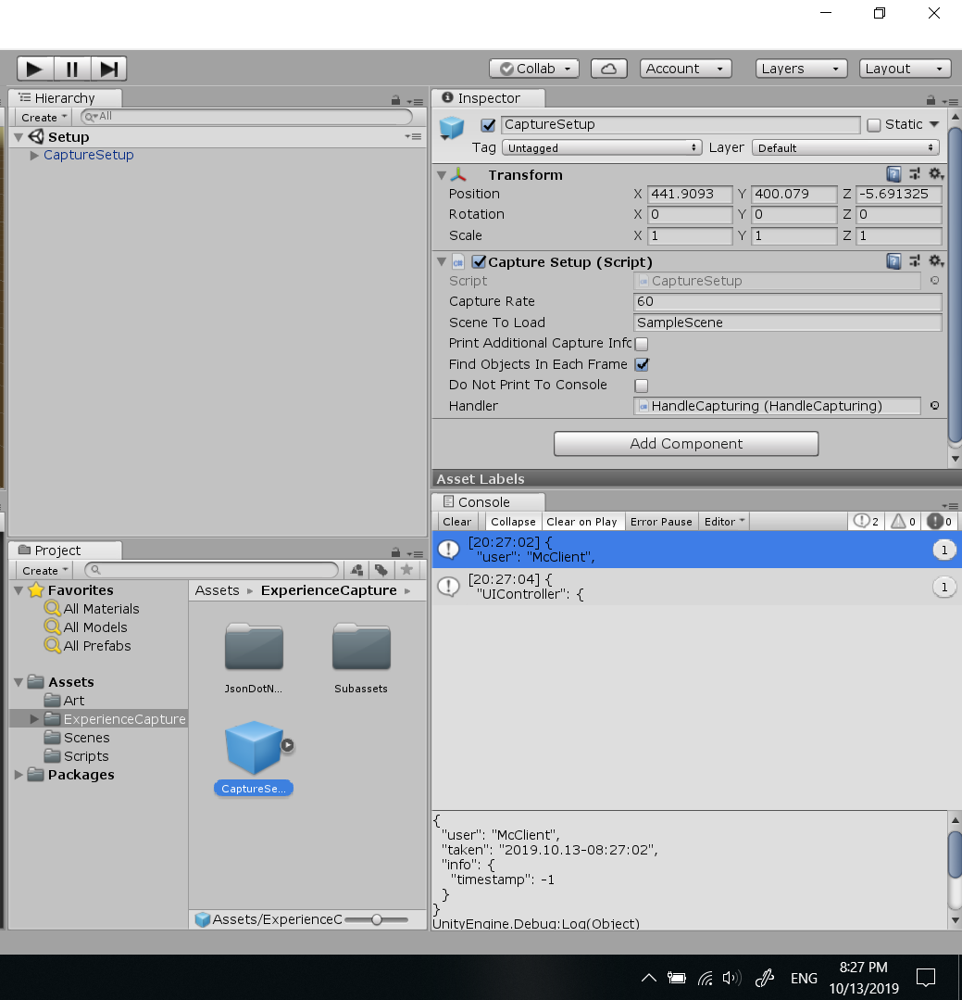

# Setup

This is assuming the Unity game doesn't have already Experience Capture installed.

## Download Asset Package

Get the latest client [here](https://github.com/jhburns/ExperienceCapture/releases/tag/client.1.2.0).

Click on the first link 'ExperienceCaptureClient.unitypackage' to download it, no extraction needed.

## Import Into Unity Game

In the Unity Editor, go to Assets -> Import Package -> Custom Package... and select it.

That will open a file-browser so you can navigate to where 'ExperienceCaptureClient.unitypackage'
is downloaded and open it. 

You should now have a pop-up with all of the assets selected by default, click on 
'Import' to add the package. (This may take a while)

**Check:** If everything worked, there should be a new folder called *ExperienceCapture/* in your assets folder.

## Create Setup Scene

In the Unity Editor's file-browser, create a new scene. It is recommended to call it 'Setup', but
isn't required. 

Next, delete everything in the new Setup scene. 

Drag the 'CaptureSetup' prefab in the root of the *ExperienceCapture/* folder into the empty scene.
(Fix the Camera on the prefab by selecting 'Solid Color' if that matters)

Change the 'Scene To Load' variable on the prefab to be the name of the first scene in your 
game. 

**Check:** Pressing start in the Unity Editor from the Setup scene should instantly load the first scene.
It should also have a 'DontDestroyOnLoad' portion with the HandleCapturing clone in it.

## Create Cleanup Scene

Create a new scene, with the name 'Cleanup' and unlike the Setup scene, the scene name
is required to be 'Cleanup'. Load the Cleanup scene when the game is done, which
is dependent on how the game is structured. DON'T close/terminate the application,
the Cleanup scene will do that for you automatically when loaded. 

**Check:** While playing does the game exit after loading the Cleanup scene?

## Next Part

If all the checks are fine, everything should be setup. Next Section: [Coding the data capture.](Coding.md)