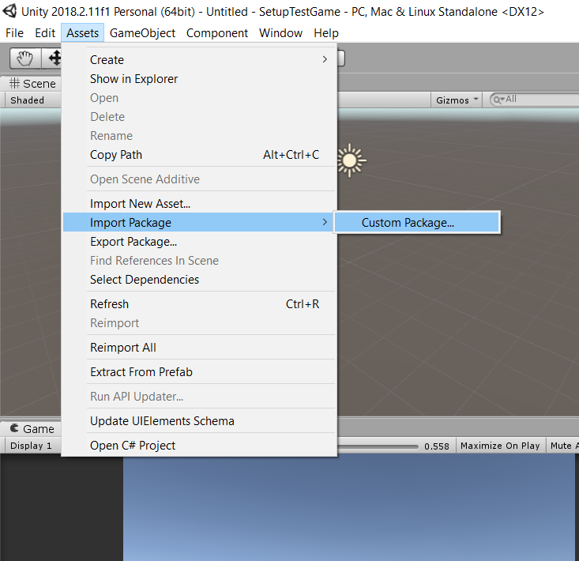

# Updating Client

Instructions for going from 1.0.0 client to 1.1.0.

## Download Asset Package

Get the client [here](https://github.com/jhburns/ExperienceCapture/releases/tag/client.1.1.0).

Click on the first link 'ExperienceCaptureClient.unitypackage' to download it, no extraction needed.

## Reimport Into Unity Game

First, Delete the old 'ExperienceCaputure' folder.

In the Unity Editor, go to Assets -> Import Package -> Custom Package... and select it.

That will open a file-browser so you can navigate to where 'ExperienceCaptureClient.unitypackage'
is downloaded and open it. 

You should now have a pop-up with all of the assets selected by default, click on 
'Import' to add the package. (This may take a while)

**Check:** If everything worked, there should be a new folder called *ExperienceCapture/* in your assets folder.

## Update Setup Scene

Remove the old 'CaptureSetup' prefab from the Setup scene.

Drag the new 'CaptureSetup' prefab in the root of the *ExperienceCapture/* folder into the Setup scene.

Change the 'Scene To Load' variable on the prefab to be the name of the first scene in your 
game. 

**Check:** Pressing start in the Unity Editor from the Setup scene should instantly load the first scene.
It should also have a 'DontDestroyOnLoad' portion with the HandleCapturing clone in it.

## Migrate, Breaking Changes

From version 1.0.0 => 1.1.0 change all instances of 'getCapture()' to 'GetCapture()'.